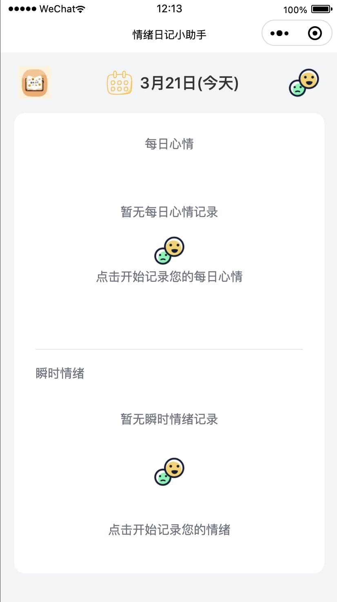

# 🌈 情绪日记小助手

## _「记录当下情绪，探索内心成长」_

1. 款帮助用户记录日常情绪的微信小程序，通过即时记录，助你更好地理解和管理情绪状态。
2. 后续计划，添加深度分析等功能

## ✨ 核心功能

### 🌟 情绪记录

- **瞬时捕捉**：一键记录当前情绪状态（😊 开心 / 😢 悲伤 / 😠 愤怒 等 7 种基础情绪）
- **多维标记**：添加具体感受、诱因、等细节标签

### 🌟 情绪统计

- **每日情绪**：当日情绪+AI 分析
- **每周情绪**：当日情绪+AI 分析
- **情绪统计**：历史情绪+AI 分析

## 🛠️ 情绪工具

- **解压画板**：涂鸦画画，解压放松
- **正念**：正念平静

### 🔒 隐私安全

- **本地存储**：所有数据全部存于设备本地

## 🎨 界面预览

# 1.0.5

## 设计一套引导弹窗

1. 每次打开后，询问用户情绪
2. veryHappy,happy,slightlyHappy,neutral,slightlyUnhappy,unhappy,veryUnhappy，七种情绪，对应七个图/images/icons/{{selectedEmotion.type}}.png
3. 用户可以选择情绪，也可以随便看看
4. 然后根据选择的情绪给出对应情绪的一个文案，文案统一管理起来，不同类型对应不同文案，然后随机选一个
5. 然后下方给出不同的入口建议，不同的入口也是不同的文案，和上面一样统一管理起来
   1. 记录入口-全部情绪
      1. const app = getApp()
      2. app.globalData.recordType = current
      3. app.globalData.selectedEmotion = 选择的情绪
      4. 记录的时候直接跳转到 /index/pages/emotion-details/emotion-details
   2. 统计分析入口-本周有情绪记录
      1. 跳转到 pages/statistics/statistics
      2. 并定位到本周情绪标签
   3. 解压工具入口-slightlyUnhappy,unhappy
   4. neutral-涂鸦
   5. unhappy-正念
6. 每个入口设计的美观好看点，入口文案也是该入口每次随机
